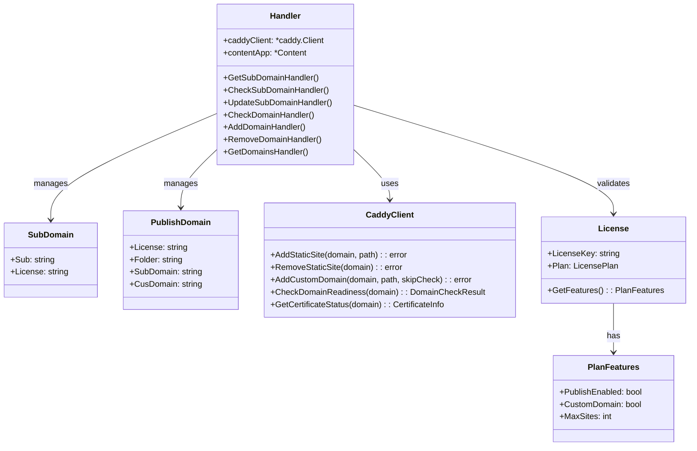

# API 域名管理系统 - 实现方案

## Implementation Prompt: API Domain Management for License Users

### Requirements Anchoring
基于已实现的 `caddy-tls-impl.md` 功能，梳理和扩展 API 后端服务，支持用户修改 subdomain、添加/移除自定义域名，并确保与现有 License 激活流程的兼容性。

---

## 1. 现有实现分析

### 1.1 数据结构

| 实体 | 字段 | 说明 |
|-----|-----|-----|
| `SubDomain` | Sub, License | 子域名分配记录，按 Sub 哈希索引 |
| `PublishDomain` | License, Folder, SubDomain, CusDomain | 发布域名配置，按 License 哈希索引 |

### 1.2 文件夹结构（固定不变）

用户的文件夹一旦分配就**不会删除或重建**，不同类型的预览内容存放在不同子目录：

```go
switch preview.Type {
case "share":
    // 分享预览：PreviewDir/UserDir/{preview.Name}
    previewDir = filepath.Join(application.PreviewDir(), s.db.UserDir(), preview.Name)
case "sub":
    // 子域名发布：PreviewDir/UserDir/mdf_sub_domain/{preview.Name}
    previewDir = filepath.Join(application.PreviewDir(), s.db.UserDir(), application.SubDomainFolder(), preview.Name)
case "custom":
    // 自定义域名发布：PreviewDir/UserDir/mdf_custom_domain/{preview.Name}
    previewDir = filepath.Join(application.PreviewDir(), s.db.UserDir(), application.CustomDomainFolder(), preview.Name)
}
```

**关键点**:
- `UserDir` (Folder) 是固定的，由系统首次激活时分配
- 修改 subdomain 只更新 Caddy 路由映射，**不涉及文件夹操作**
- 添加自定义域名同样只更新路由，文件夹路径保持不变

### 1.3 现有 License 激活流程

```
POST /api/license/activate
    ↓
首次激活 (firstTimeActivation = true)
    ↓
检查 PublishEnabled 功能
    ↓
检查 SubDomain 是否已存在 (GetSubDomainByKey(UserDir))
    ↓
不存在时：
  1. 创建 SubDomain 记录 {Sub: UserDir, License: LicenseKey}
  2. 创建 PublishDomain 记录 {License, SubDomain, Folder, CusDomain: ""}
  3. 调用 caddyClient.AddStaticSite(subdomain.domain, sitePath)
```

### 1.4 当前 Caddy Client 初始化

```go
// handler.go:72
caddyClient := caddy.NewClient(&caddy.Config{})  // 使用默认配置
```

**问题**: 默认配置缺少 `ServerIP`，无法进行域名预检测。

---

## 2. 影响分析

### 2.1 对现有功能的影响

| 功能 | 是否受影响 | 原因 |
|-----|---------|-----|
| License 激活分配 SubDomain | ✅ 不受影响 | 子域名使用 Wildcard 证书（已由 caddy start 预置），只需添加 HTTP route |
| AddStaticSite 方法 | ✅ 不受影响 | 对于 *.mdfriday.com 子域名，只需 HTTP route，无需单独 TLS policy |
| SubDomain 修改 | 🆕 需新增 | 现有实现不支持修改 subdomain |
| 自定义域名 CusDomain | 🆕 需新增 | 现有实现只预留了 CusDomain 字段，未实现功能 |

### 2.2 需要调整的地方

#### Handler 初始化调整

```go
// handler.go - 需要从 adminApp 读取 ServerIP 配置
caddyClient := caddy.NewClient(&caddy.Config{
    ServerIP: adminApp.ServerIP(),  // 新增：用于域名预检测
})
```

**依赖**: `adminApp` 需要新增 `ServerIP()` 方法，从配置中读取服务器公网 IP。

#### Admin 配置扩展

```go
// admin 配置结构需要新增
type AdminConfig struct {
    // ... 现有字段
    ServerIP string `json:"server_ip"` // 服务器公网 IP，用于域名检测
}
```

---

## 3. 新增 API 设计

### 3.1 API 端点总览

| 端点 | 方法 | 说明 | 认证 |
|-----|-----|-----|-----|
| `/api/license/subdomain` | GET | 获取当前 subdomain 信息 | 需要 |
| `/api/license/subdomain/check` | POST | 检查 subdomain 是否可用 | 需要 |
| `/api/license/subdomain/update` | POST | 修改 subdomain | 需要 |
| `/api/license/domain/check` | POST | 检查自定义域名就绪状态 | 需要 |
| `/api/license/domain/add` | POST | 添加自定义域名 | 需要 |
| `/api/license/domain/remove` | POST | 移除自定义域名 | 需要 |
| `/api/license/domains` | GET | 获取用户所有域名配置 | 需要 |

### 3.2 详细设计

#### 3.2.1 获取 SubDomain 信息

**请求**:
```http
GET /api/license/subdomain?key=MDF-XXXX-XXXX-XXXX
```

**响应**:
```go
s.jsonResponse(res, map[string]interface{}{
    "subdomain":   sd.Sub,
    "full_domain": fmt.Sprintf("%s.%s", sd.Sub, s.adminApp.Domain()),
    "folder":      pd.Folder,
    "created_at":  sd.Timestamp,
})
```

```json
{
  "subdomain": "user123",
  "full_domain": "user123.mdfriday.com",
  "folder": "user123",
  "created_at": 1704067200000
}
```

#### 3.2.2 检查 SubDomain 可用性（新增）

**请求**:
```http
POST /api/license/subdomain/check
Content-Type: multipart/form-data

license_key=MDF-XXXX-XXXX-XXXX
subdomain=mynewsite
```

**处理流程**:
```
1. 验证 License 有效性
2. 验证 subdomain 格式（长度 >= 4，只允许小写字母、数字、连字符）
3. 检查是否为保留字段
4. 检查 subdomain 是否已被占用 (GetSubDomainByKey)
5. 返回可用性结果
```

**响应 - 可用**:
```go
s.jsonResponse(res, map[string]interface{}{
    "subdomain": subdomain,
    "available": true,
    "message":   "Subdomain is available",
})
```

```json
{
  "subdomain": "mynewsite",
  "available": true,
  "message": "Subdomain is available"
}
```

**响应 - 不可用（已被占用）**:
```go
s.jsonResponse(res, map[string]interface{}{
    "subdomain": subdomain,
    "available": false,
    "reason":    "taken",
    "message":   "Subdomain is already taken",
})
```

```json
{
  "subdomain": "mynewsite",
  "available": false,
  "reason": "taken",
  "message": "Subdomain is already taken"
}
```

**响应 - 不可用（格式错误）**:
```go
s.jsonResponse(res, map[string]interface{}{
    "subdomain": subdomain,
    "available": false,
    "reason":    "invalid_format",
    "message":   "Subdomain must be at least 4 characters long",
})
```

```json
{
  "subdomain": "ab",
  "available": false,
  "reason": "invalid_format",
  "message": "Subdomain must be at least 4 characters long"
}
```

**响应 - 不可用（保留字段）**:
```go
s.jsonResponse(res, map[string]interface{}{
    "subdomain": subdomain,
    "available": false,
    "reason":    "reserved",
    "message":   fmt.Sprintf("Subdomain '%s' is reserved", subdomain),
})
```

```json
{
  "subdomain": "admin",
  "available": false,
  "reason": "reserved",
  "message": "Subdomain 'admin' is reserved"
}
```

#### 3.2.3 修改 SubDomain

**请求**:
```http
POST /api/license/subdomain/update
Content-Type: multipart/form-data

license_key=MDF-XXXX-XXXX-XXXX
new_subdomain=mynewsite
```

**处理流程**:
```
1. 验证 License 有效性和 PublishEnabled 权限
2. 验证新 subdomain 格式（长度 >= 4，只允许小写字母、数字、连字符）
3. 检查新 subdomain 是否已被占用 (GetSubDomainByKey)
4. 如果被占用，返回错误
5. 获取旧的 SubDomain 记录
6. 调用 caddyClient.RemoveStaticSite(old_subdomain.mdfriday.com)
7. 更新 SubDomain 记录 (Sub = new_subdomain)
8. 更新 PublishDomain 记录 (SubDomain = new_subdomain)
9. 调用 caddyClient.AddStaticSite(new_subdomain.mdfriday.com, sitePath)
   - sitePath 不变: PreviewDir/UserDir/SubDomainFolder/
10. 返回成功

注意：文件夹保持不变，只更新 Caddy 路由映射
```

**响应**:
```go
s.jsonResponse(res, map[string]interface{}{
    "old_subdomain": oldSub,
    "new_subdomain": newSub,
    "full_domain":   fmt.Sprintf("%s.%s", newSub, s.adminApp.Domain()),
    "message":       "Subdomain updated successfully",
})
```

```json
{
  "old_subdomain": "user123",
  "new_subdomain": "mynewsite",
  "full_domain": "mynewsite.mdfriday.com",
  "message": "Subdomain updated successfully"
}
```

**错误响应**:
```go
s.jsonError(res, "Subdomain 'mynewsite' is already taken", http.StatusConflict)
```

```json
{
  "success": false,
  "error": "Subdomain 'mynewsite' is already taken"
}
```

#### 3.2.4 检查自定义域名就绪状态

**请求**:
```http
POST /api/license/domain/check
Content-Type: multipart/form-data

license_key=MDF-XXXX-XXXX-XXXX
domain=hello.com
```

**处理流程**:
```
1. 验证 License 有效性
2. 验证 CustomDomain 权限 (license.GetFeatures().CustomDomain)
3. 调用 caddyClient.CheckDomainReadiness(domain)
4. 返回检查结果
```

**响应 - 域名就绪**:
```go
s.jsonResponse(res, map[string]interface{}{
    "domain":         domain,
    "dns_valid":      result.DNSValid,
    "resolved_ips":   result.ResolvedIPs,
    "http_reachable": result.HTTPReachable,
    "ready":          result.Ready,
    "message":        "Domain is ready for HTTPS certificate issuance",
})
```

```json
{
  "domain": "hello.com",
  "dns_valid": true,
  "resolved_ips": ["1.2.3.4"],
  "http_reachable": true,
  "ready": true,
  "message": "Domain is ready for HTTPS certificate issuance"
}
```

**响应 - DNS 未配置**:
```go
s.jsonResponse(res, map[string]interface{}{
    "domain":         domain,
    "dns_valid":      false,
    "resolved_ips":   result.ResolvedIPs,
    "http_reachable": false,
    "ready":          false,
    "error":          fmt.Sprintf("DNS does not point to server IP %s, found: %v", serverIP, result.ResolvedIPs),
})
```

```json
{
  "domain": "hello.com",
  "dns_valid": false,
  "resolved_ips": ["5.6.7.8"],
  "http_reachable": false,
  "ready": false,
  "error": "DNS does not point to server IP 1.2.3.4, found: [5.6.7.8]"
}
```

#### 3.2.5 添加自定义域名

**请求**:
```http
POST /api/license/domain/add
Content-Type: multipart/form-data

license_key=MDF-XXXX-XXXX-XXXX
domain=hello.com
```

**处理流程**:
```
1. 验证 License 有效性
2. 验证 CustomDomain 权限
3. 检查用户是否已有自定义域名（根据 Plan 限制）
4. 执行域名预检测 (caddyClient.CheckDomainReadiness)
5. 如果 !ready，返回错误并提示用户配置 DNS
6. 检查域名是否已被其他用户使用
7. 调用 caddyClient.AddCustomDomain(domain, sitePath, skipCheck=false)
   - 这会添加 HTTP route + HTTP-01 TLS policy
8. 更新 PublishDomain 记录 (CusDomain = domain)
9. 返回成功
```

**响应 - 成功**:
```go
s.jsonResponse(res, map[string]interface{}{
    "domain":  domain,
    "status":  "pending_certificate",
    "message": "Custom domain added. SSL certificate is being issued.",
})
```

```json
{
  "domain": "hello.com",
  "status": "pending_certificate",
  "message": "Custom domain added. SSL certificate is being issued."
}
```

**错误响应 - 域名未就绪**:
```go
s.jsonError(res, "Domain DNS is not configured correctly. Please point your domain to "+serverIP, http.StatusBadRequest)
```

```json
{
  "success": false,
  "error": "Domain DNS is not configured correctly. Please point your domain to 1.2.3.4"
}
```

**错误响应 - 域名已被使用**:
```go
s.jsonError(res, "Domain is already in use by another user", http.StatusConflict)
```

```json
{
  "success": false,
  "error": "Domain is already in use by another user"
}
```

#### 3.2.6 移除自定义域名

**请求**:
```http
POST /api/license/domain/remove
Content-Type: multipart/form-data

license_key=MDF-XXXX-XXXX-XXXX
domain=hello.com
```

**处理流程**:
```
1. 验证 License 有效性
2. 获取 PublishDomain 记录
3. 验证域名属于该用户 (CusDomain == domain)
4. 调用 caddyClient.RemoveStaticSite(domain)
5. 移除对应的 TLS policy（如果有）
6. 更新 PublishDomain 记录 (CusDomain = "")
7. 返回成功
```

**响应**:
```go
s.jsonResponse(res, map[string]interface{}{
    "domain":  domain,
    "message": "Custom domain removed successfully",
})
```

```json
{
  "domain": "hello.com",
  "message": "Custom domain removed successfully"
}
```

**错误响应 - 域名不属于该用户**:
```go
s.jsonError(res, "Domain does not belong to this license", http.StatusForbidden)
```

```json
{
  "success": false,
  "error": "Domain does not belong to this license"
}
```

#### 3.2.7 获取用户所有域名配置

**请求**:
```http
GET /api/license/domains?key=MDF-XXXX-XXXX-XXXX
```

**响应**:
```go
response := map[string]interface{}{
    "license_key":     license.LicenseKey,
    "platform_domain": s.adminApp.Domain(),
    "subdomain": map[string]interface{}{
        "name":        sd.Sub,
        "full_domain": fmt.Sprintf("%s.%s", sd.Sub, s.adminApp.Domain()),
        "status":      "active",
    },
    "features": map[string]interface{}{
        "custom_domain_enabled": license.GetFeatures().CustomDomain,
        "max_custom_domains":    1,
    },
}

// 如果有自定义域名
if pd.CusDomain != "" {
    certInfo, _ := s.caddyClient.GetCertificateStatus(pd.CusDomain)
    response["custom_domain"] = map[string]interface{}{
        "domain": pd.CusDomain,
        "status": "active",
        "certificate": map[string]interface{}{
            "status":     certInfo.Status,
            "issuer":     certInfo.Issuer,
            "expires_at": certInfo.NotAfter,
        },
    }
}

s.jsonResponse(res, response)
```

**响应 - 有自定义域名**:
```json
{
  "license_key": "MDF-XXXX-XXXX-XXXX",
  "platform_domain": "mdfriday.com",
  "subdomain": {
    "name": "user123",
    "full_domain": "user123.mdfriday.com",
    "status": "active"
  },
  "custom_domain": {
    "domain": "hello.com",
    "status": "active",
    "certificate": {
      "status": "issued",
      "issuer": "Let's Encrypt",
      "expires_at": "2024-12-01T00:00:00Z"
    }
  },
  "features": {
    "custom_domain_enabled": true,
    "max_custom_domains": 1
  }
}
```

**响应 - 无自定义域名**:
```json
{
  "license_key": "MDF-XXXX-XXXX-XXXX",
  "platform_domain": "mdfriday.com",
  "subdomain": {
    "name": "user123",
    "full_domain": "user123.mdfriday.com",
    "status": "active"
  },
  "features": {
    "custom_domain_enabled": true,
    "max_custom_domains": 1
  }
}
```

---

## 4. Business Model



---

## 5. Tasks

### Task 1: 扩展 Admin 配置
1. **Responsibility**: 添加 ServerIP 配置字段
2. **File**: `internal/domain/admin/entity/admin.go`
3. **Changes**:
   - 添加 `ServerIP() string` 方法
   - 从配置文件或环境变量读取

### Task 2: 调整 Handler 初始化
1. **Responsibility**: 传入 ServerIP 到 Caddy Client
2. **File**: `internal/interfaces/api/handler/handler.go`
3. **Changes**:
   ```go
   caddyClient := caddy.NewClient(&caddy.Config{
       ServerIP: adminApp.ServerIP(),
   })
   ```

### Task 3: 注册新 API 端点
1. **Responsibility**: 在 handlers.go 中注册域名管理 API
2. **File**: `internal/interfaces/api/handlers.go`
3. **Changes**:
   ```go
   // SubDomain 管理
   s.mux.HandleFunc("/api/license/subdomain", s.wrapContentHandler(s.handler.GetSubDomainHandler))
   s.mux.HandleFunc("/api/license/subdomain/check", s.wrapContentHandler(s.handler.CheckSubDomainHandler))
   s.mux.HandleFunc("/api/license/subdomain/update", s.wrapContentHandler(s.handler.UpdateSubDomainHandler))
   
   // 自定义域名管理
   s.mux.HandleFunc("/api/license/domain/check", s.wrapContentHandler(s.handler.CheckDomainHandler))
   s.mux.HandleFunc("/api/license/domain/add", s.wrapContentHandler(s.handler.AddDomainHandler))
   s.mux.HandleFunc("/api/license/domain/remove", s.wrapContentHandler(s.handler.RemoveDomainHandler))
   s.mux.HandleFunc("/api/license/domains", s.wrapContentHandler(s.handler.GetDomainsHandler))
   ```

### Task 4: 实现 GetSubDomainHandler
1. **Responsibility**: 获取当前 subdomain 信息
2. **File**: `internal/interfaces/api/handler/handledomain.go` (新文件)
3. **Logic**:
   - 验证 License
   - 获取 PublishDomain 记录
   - 返回 subdomain 信息

### Task 5: 实现 CheckSubDomainHandler（新增）
1. **Responsibility**: 检查 subdomain 是否可用（前端预检）
2. **File**: `internal/interfaces/api/handler/handledomain.go`
3. **Logic**:
   - 验证格式（长度 >= 4，只允许小写字母、数字、连字符）
   - 检查是否为保留字段
   - 检查是否已被占用 (GetSubDomainByKey)
   - 返回可用性结果和原因

### Task 6: 实现 UpdateSubDomainHandler
1. **Responsibility**: 修改用户的 subdomain
2. **File**: `internal/interfaces/api/handler/handledomain.go`
3. **Logic**:
   - 验证新 subdomain 格式 (正则: `^[a-z0-9][a-z0-9-]{2,}[a-z0-9]$`，最小长度 4)
   - 检查唯一性
   - 更新 Caddy 路由（先移除旧的，再添加新的）
   - 更新数据库记录
   - **注意**：文件夹路径保持不变，只更新路由映射

### Task 7: 实现 CheckDomainHandler
1. **Responsibility**: 检查自定义域名就绪状态（DNS + HTTP 可达性）
2. **File**: `internal/interfaces/api/handler/handledomain.go`
3. **Logic**:
   - 验证 CustomDomain 权限
   - 调用 `caddyClient.CheckDomainReadiness(domain)`
   - 返回详细检查结果

### Task 8: 实现 AddDomainHandler
1. **Responsibility**: 添加自定义域名
2. **File**: `internal/interfaces/api/handler/handledomain.go`
3. **Logic**:
   - 权限检查
   - 域名预检测
   - 调用 `caddyClient.AddCustomDomain`
   - sitePath: `PreviewDir/UserDir/CustomDomainFolder/`
   - 更新 PublishDomain.CusDomain

### Task 9: 实现 RemoveDomainHandler
1. **Responsibility**: 移除自定义域名
2. **File**: `internal/interfaces/api/handler/handledomain.go`
3. **Logic**:
   - 验证域名属于用户
   - 移除 Caddy 路由和 TLS policy
   - 清空 PublishDomain.CusDomain
   - **注意**：不删除文件夹

### Task 10: 实现 GetDomainsHandler
1. **Responsibility**: 获取用户所有域名配置
2. **File**: `internal/interfaces/api/handler/handledomain.go`
3. **Logic**:
   - 获取 subdomain 信息
   - 获取 custom domain 信息
   - 查询证书状态（如果有自定义域名）

### Task 11: SubDomain 格式验证
1. **Responsibility**: 验证 subdomain 格式合法性
2. **File**: `internal/interfaces/api/handler/handledomain.go`
3. **规则**:
   - **最小长度: 4 字符**（用户可自定义）
   - 最大长度: 32 字符
   - 只允许: 小写字母、数字、连字符
   - 不能以连字符开头或结尾
   - 正则: `^[a-z0-9][a-z0-9-]{2,30}[a-z0-9]$`
   - 保留字段: `www`, `api`, `admin`, `cdb`, `mail`, `ftp`, `smtp`, `pop`, `imap` 等

---

## 6. Constraints

### 功能约束
1. 修改 subdomain 需要先检查唯一性
2. 添加自定义域名必须通过预检测
3. 每个 License 只能有一个 subdomain
4. 自定义域名数量由 Plan 决定

### 安全约束
1. 所有 API 需要 License 认证
2. 只能操作自己的域名
3. 禁止添加已被其他用户使用的域名

### 性能约束
1. 域名检查超时: 15 秒
2. Caddy API 操作超时: 30 秒

---

## 7. File Structure

```
internal/interfaces/api/
├── handlers.go           # 注册新端点
└── handler/
    ├── handler.go        # 调整 Caddy Client 初始化
    ├── handlelicense.go  # 现有 License API (不修改)
    └── handledomain.go   # 新增：域名管理 API

internal/domain/admin/
└── entity/
    └── admin.go          # 添加 ServerIP() 方法
```

---

## 8. Implementation Checklist

### Phase 1: 基础设施调整
- [ ] Admin 配置添加 ServerIP 字段
- [ ] Handler 初始化传入 ServerIP
- [ ] 注册新 API 端点

### Phase 2: SubDomain 管理
- [ ] GetSubDomainHandler
- [ ] CheckSubDomainHandler（可用性检查）
- [ ] UpdateSubDomainHandler
- [ ] SubDomain 格式验证（长度 >= 4）

### Phase 3: 自定义域名管理
- [ ] CheckDomainHandler
- [ ] AddDomainHandler
- [ ] RemoveDomainHandler
- [ ] GetDomainsHandler

### Phase 4: 测试验证
- [ ] SubDomain 修改流程测试
- [ ] 自定义域名添加流程测试
- [ ] 权限控制测试
- [ ] 错误处理测试

---

## 9. Migration Notes

### 现有用户数据
- 现有 SubDomain 和 PublishDomain 记录无需迁移
- CusDomain 字段已存在，默认为空
- Folder (UserDir) 保持不变

### 文件夹规则（重要）
- **用户文件夹是固定的，永不删除或重建**
- 修改 subdomain 只更新 Caddy 路由，不涉及文件夹操作
- 文件夹结构：
  - 子域名内容：`PreviewDir/UserDir/mdf_sub_domain/`
  - 自定义域名内容：`PreviewDir/UserDir/mdf_custom_domain/`

### Caddy 配置
- 确保 `caddy start` 时已预置 Wildcard 策略
- 子域名路由使用 `AddStaticSite`（无 TLS policy）
- 自定义域名使用 `AddCustomDomain`（含 HTTP-01 TLS policy）
- sitePath 指向用户固定的文件夹

### 向后兼容
- 现有 License 激活流程不变
- 新增 API 为可选功能
- 未配置 ServerIP 时，域名检查返回跳过提示

### SubDomain 长度规则
- 系统自动分配的 subdomain 可能小于 4 字符（UserDir）
- 用户自行修改的 subdomain 必须 >= 4 字符
- 这样设计是为了区分系统分配和用户自定义

