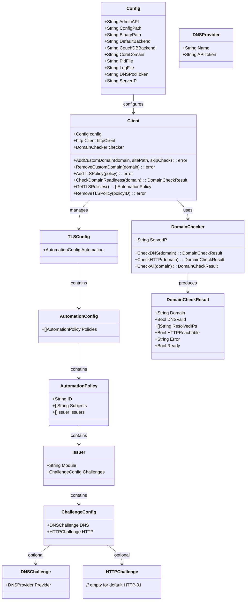

# Caddy TLS 证书管理系统 - 实现方案

## Implementation Prompt: Caddy TLS Certificate Management with Multi-Domain Support

### Requirements Anchoring
基于现有的 Caddy 基础设施实现，扩展 TLS 证书管理功能，支持平台域名（Wildcard 证书，DNS-01）和用户自定义域名（HTTP-01），并实现域名预检测机制确保证书签发成功率。

### 前提条件：构建包含腾讯云 DNS 插件的 Caddy

使用 DNS-01 challenge 获取 Wildcard 证书需要 Caddy 在构建时包含对应的 DNS provider 插件。
官方预编译的 Caddy 二进制文件**不支持** DNS-01 challenge。

**重要说明：**
- DNSPod 已被腾讯云收购，原 `github.com/caddy-dns/dnspod` 已过时且与新版 libdns 不兼容
- 请使用 `github.com/caddy-dns/tencentcloud` 插件
- Provider name 为 `tencentcloud`
- API Token 格式：`SecretId,SecretKey`（用逗号分隔）

**在 Ubuntu 上构建包含腾讯云 DNS 插件的 Caddy：**

```bash
# 1. 安装 Go (如果尚未安装)
sudo apt update
sudo apt install golang-go

# 2. 安装 xcaddy
go install github.com/caddyserver/xcaddy/cmd/xcaddy@latest

# 3. 构建包含腾讯云 DNS 插件的 Caddy
~/go/bin/xcaddy build --with github.com/caddy-dns/tencentcloud

# 4. 将构建好的 caddy 移动到 PATH
sudo mv caddy /usr/local/bin/

# 5. 验证安装
caddy list-modules | grep dns.providers
# 应输出: dns.providers.tencentcloud
```

**注意：** 如果不需要 Wildcard 证书（开发环境或只使用 HTTP-01），可以使用官方预编译版本。

### Business Model


### Solution
1. **架构设计**:
   - 扩展现有 Config 结构，添加 DNSPod Token 和服务器 IP 配置
   - 新增 TLS 配置结构体，支持 ACME automation policies
   - 实现 DomainChecker 组件，用于域名预检测
   - 在 Client 中集成域名检查和 TLS 策略管理

2. **技术实现**:
   - 使用 `net.LookupHost` 进行 DNS 解析检查
   - 使用 HTTP 客户端进行 80 端口可达性检查
   - 通过 Caddy Admin API 动态管理 TLS automation policies
   - 支持 DNS-01（平台域名）和 HTTP-01（用户域名）两种 challenge 类型

3. **业务逻辑**:
   - **平台域名（Wildcard 证书）**:
     - 启动时预置 DNS-01 策略（mdfriday.com + *.mdfriday.com）
     - 所有 subdomain 自动使用 Wildcard 证书，无需单独申请
     - subdomain 只需添加 route（AddStaticSite）
   - **用户自定义域名（HTTP-01 证书）**:
     - 添加前必须通过域名预检测（DNS + HTTP）
     - 每个 License 最多一个自定义域名
     - 需要单独的 TLS policy（policy ID = `custom-{domain}`）

### Structure

#### Inheritance Relationships
1. Config 结构体扩展，添加 TLS 相关配置
2. Client 结构体扩展，集成 DomainChecker
3. 新增 TLS 配置结构体层次
4. 新增 DomainChecker 独立组件

#### Dependencies
1. Client 依赖 DomainChecker 进行域名检查
2. Client 依赖 Config 获取配置
3. CLI 层依赖 Client 执行操作
4. DomainChecker 依赖 net 和 http 标准库

#### Layered Architecture
1. CLI Layer: 命令行参数解析、用户交互
2. Infrastructure Layer: Caddy 客户端、域名检查器
3. Configuration Layer: TLS 策略配置生成
4. Network Layer: DNS 解析、HTTP 检查

### Tasks

#### 扩展 Config 结构体
1. **Responsibility**: 添加 TLS 相关配置字段
2. **File**: `internal/infrastructure/caddy/client.go`
3. **New Fields**:
   - `DNSPodToken string`: DNSPod API Token（用于平台域名 DNS-01）
   - `ServerIP string`: 服务器公网 IP（用于 DNS 检查验证）
4. **Default Values**:
   - DNSPodToken: 从环境变量 `DNSPOD_API_TOKEN` 读取
   - ServerIP: 自动检测或手动配置

#### 创建 TLS 配置结构体
1. **Responsibility**: 定义 Caddy TLS JSON 配置结构
2. **File**: `internal/infrastructure/caddy/tls.go`
3. **Structs**:

```go
// TLSConfig TLS App 配置
type TLSConfig struct {
    Automation *AutomationConfig `json:"automation,omitempty"`
}

// AutomationConfig 自动证书管理配置
type AutomationConfig struct {
    Policies []AutomationPolicy `json:"policies,omitempty"`
}

// AutomationPolicy 证书策略
type AutomationPolicy struct {
    ID       string   `json:"@id,omitempty"`
    Subjects []string `json:"subjects"`
    Issuers  []Issuer `json:"issuers,omitempty"`
}

// Issuer 证书签发器配置
type Issuer struct {
    Module     string           `json:"module"`
    Challenges *ChallengeConfig `json:"challenges,omitempty"`
}

// ChallengeConfig ACME Challenge 配置
type ChallengeConfig struct {
    DNS  *DNSChallenge  `json:"dns,omitempty"`
    HTTP *HTTPChallenge `json:"http,omitempty"`
}

// DNSChallenge DNS-01 Challenge 配置
type DNSChallenge struct {
    Provider *DNSProvider `json:"provider"`
}

// DNSProvider DNS 提供商配置
type DNSProvider struct {
    Name     string `json:"name"`
    APIToken string `json:"api_token"`
}

// HTTPChallenge HTTP-01 Challenge 配置
type HTTPChallenge struct {
    // 空结构表示使用默认 HTTP-01
}
```

#### 创建 DomainChecker 组件
1. **Responsibility**: 域名 DNS 和 HTTP 可达性检查
2. **File**: `internal/infrastructure/caddy/domain_checker.go`
3. **Methods**:
   - `NewDomainChecker(serverIP string) *DomainChecker`
   - `(c *DomainChecker) CheckDNS(domain string) *DomainCheckResult`
   - `(c *DomainChecker) CheckHTTP(domain string) *DomainCheckResult`
   - `(c *DomainChecker) CheckAll(domain string) *DomainCheckResult`
4. **DomainCheckResult Struct**:

```go
// DomainCheckResult 域名检查结果
type DomainCheckResult struct {
    Domain        string   `json:"domain"`
    DNSValid      bool     `json:"dns_valid"`
    ResolvedIPs   []string `json:"resolved_ips"`
    HTTPReachable bool     `json:"http_reachable"`
    Error         string   `json:"error,omitempty"`
    Ready         bool     `json:"ready"`
}
```

5. **Logic**:
   - CheckDNS: 使用 `net.LookupHost` 解析域名，验证是否包含服务器 IP
   - CheckHTTP: 访问 `http://{domain}/.well-known/acme-challenge/test` 验证可达性
   - CheckAll: 依次执行 DNS 和 HTTP 检查，全部通过则 Ready=true

#### 扩展 Client - TLS 策略管理方法
1. **Responsibility**: 通过 Admin API 管理 TLS 策略
2. **File**: `internal/infrastructure/caddy/client.go`
3. **New Methods**:
   - `AddTLSPolicy(policy AutomationPolicy) error`
     - Logic: POST 到 `/config/apps/tls/automation/policies`
   - `GetTLSPolicies() ([]AutomationPolicy, error)`
     - Logic: GET `/config/apps/tls/automation/policies`
   - `RemoveTLSPolicy(policyID string) error`
     - Logic: DELETE `/id/{policyID}`
   - `UpdateTLSPolicy(policyID string, policy AutomationPolicy) error`
     - Logic: PATCH `/id/{policyID}`

#### 扩展 Client - 自定义域名添加（带预检测）
1. **Responsibility**: 安全地添加用户自定义域名
2. **File**: `internal/infrastructure/caddy/client.go`
3. **New Method**: `AddCustomDomain(domain, sitePath string, skipCheck bool) error`
4. **Logic**:
   ```
   1. 如果 !skipCheck:
      a. 执行 DomainChecker.CheckAll(domain)
      b. 如果 !result.Ready, 返回详细错误
   2. 添加 HTTP route (使用现有 AddStaticSite)
   3. 创建单域名 HTTP-01 TLS policy
      - policy ID: "custom-{sanitized_domain}"
      - subjects: [domain]
   4. 添加 TLS policy
   5. 返回成功
   ```
5. **New Method**: `RemoveCustomDomain(domain string) error`
6. **Logic**:
   ```
   1. 移除 HTTP route (使用现有 RemoveStaticSite)
   2. 移除对应的 TLS policy (policy ID: "custom-{sanitized_domain}")
   3. 返回成功
   ```

#### 扩展 Client - 启动时预置平台域名策略
1. **Responsibility**: 启动时配置平台域名的 Wildcard 证书
2. **File**: `internal/infrastructure/caddy/client.go`
3. **Modify**: `StartServerBackground` 方法
4. **Logic**:
   ```
   生产环境启动流程（CoreDomain != localhost/127.0.0.1）：
   
   1. 生成 HTTP 配置（routes）
   2. 检查是否配置了 DNSPodToken
   3. 如果配置了 DNSPodToken：
      a. 调用 tls.GeneratePlatformTLSConfig(coreDomain, dnspodToken) 生成 TLS 配置
      b. 将 TLS 配置包含在 AppsConfig 中
   4. 生成完整的 CaddyConfig（含 TLS）
   5. 写入配置文件并启动 Caddy
   
   TLS 配置包含：
   - policy ID: "platform-wildcard"
   - subjects: ["{coreDomain}", "*.{coreDomain}"]
   - issuers: ACME with DNS-01 challenge (dnspod provider)
   
   效果：
   - mdfriday.com 和 *.mdfriday.com 自动获取 Wildcard 证书
   - 所有 subdomain（如 user123.mdfriday.com）使用 Wildcard 证书
   - 无需为 subdomain 单独申请证书
   - 只有用户自定义域名（如 hello.com）需要单独申请 HTTP-01 证书
   ```

#### 扩展 tls.go - TLS 配置生成函数
1. **Responsibility**: 提供 TLS 配置生成的统一入口
2. **File**: `internal/infrastructure/caddy/tls.go`
3. **New Functions**:
   ```go
   // GeneratePlatformTLSConfig 生成平台域名的 TLS 配置
   // 用于启动时配置 Wildcard 证书
   func GeneratePlatformTLSConfig(coreDomain, dnspodToken string) *TLSConfig
   
   // IsPlatformDomain 判断域名是否为平台域名（使用 Wildcard 证书）
   func IsPlatformDomain(domain, coreDomain string) bool
   ```

#### 扩展 AppsConfig 结构体
1. **Responsibility**: 支持 TLS App 配置
2. **File**: `internal/infrastructure/caddy/client.go`
3. **Modification**:

```go
// AppsConfig Caddy Apps 配置
type AppsConfig struct {
    HTTP *HTTPConfig `json:"http"`
    TLS  *TLSConfig  `json:"tls,omitempty"`
}
```

#### 添加 CLI 子命令 - domain
1. **Responsibility**: 用户自定义域名管理命令
2. **File**: `internal/interfaces/cli/caddy.go`
3. **New Subcommand**: `hugov caddy domain`
4. **Sub-subcommands**:
   - `check`: 检查域名就绪状态
   - `add`: 添加自定义域名（带预检测）
   - `list`: 列出所有自定义域名
   - `remove`: 移除自定义域名

#### 实现 runDomain CLI 处理器
1. **Responsibility**: 处理 domain 子命令
2. **File**: `internal/interfaces/cli/caddy.go`
3. **Methods**:
   - `runDomain(args []string) error`: 主处理器
   - `runDomainCheck(args []string) error`: 检查域名
   - `runDomainAdd(args []string) error`: 添加域名
   - `runDomainList(args []string) error`: 列出域名
   - `runDomainRemove(args []string) error`: 移除域名

#### 添加 CLI 子命令 - tls
1. **Responsibility**: TLS 策略管理命令
2. **File**: `internal/interfaces/cli/caddy.go`
3. **New Subcommand**: `hugov caddy tls`
4. **Sub-subcommands**:
   - `policies`: 查看所有 TLS 策略
   - `add-policy`: 添加新策略
   - `remove-policy`: 移除策略

### Common Tasks
1. **Error Handling**: 
   - 所有网络操作需要超时控制
   - DNS 检查失败返回详细错误信息
   - HTTP 检查失败返回状态码和响应

2. **Logging**: 
   - 域名检查过程日志
   - TLS 策略变更日志
   - 证书签发状态日志

3. **Configuration Validation**:
   - 验证 DNSPodToken 非空（生产环境）
   - 验证 ServerIP 格式正确
   - 验证域名格式合法

### Constraints

#### Functional Constraints
1. 平台域名（mdfriday.com, *.mdfriday.com）必须使用 DNS-01
2. 用户自定义域名必须使用 HTTP-01
3. 添加用户域名前必须通过 DNS 和 HTTP 检查
4. 每个 License 最多只能绑定一个自定义域名（单域名处理模式）

#### Performance Constraints
1. DNS 检查超时: 10 秒
2. HTTP 检查超时: 15 秒
3. 域名检查应支持并行执行

#### Security Constraints
1. DNSPodToken 应从环境变量读取，不硬编码
2. 用户域名 DNS 必须指向平台服务器 IP
3. 不允许跳过检查添加生产环境域名

#### Integration Constraints
1. 必须使用现有 Caddy Admin API 架构
2. 必须兼容现有 Config 和 Client 结构
3. 必须遵循现有 CLI 命令结构

### CLI 使用示例

```bash
# 启动服务器（生产环境，启用 Wildcard 证书）
hugov caddy start -domain mdfriday.com -dnspod-token $DNSPOD_API_TOKEN -server-ip 1.2.3.4

# 检查用户域名就绪状态
hugov caddy domain check -domain hello.com -server-ip 1.2.3.4

# 添加用户自定义域名（带预检测）
hugov caddy domain add -domain hello.com -path /data/sites/hello-com

# 添加用户自定义域名（跳过检测，仅开发环境）
hugov caddy domain add -domain hello.com -path /data/sites/hello-com -skip-check

# 列出所有自定义域名
hugov caddy domain list

# 移除自定义域名
hugov caddy domain remove -domain hello.com

# 查看 TLS 策略
hugov caddy tls policies

# 手动添加单域名 TLS 策略
hugov caddy tls add-policy -domain hello.com -challenge http

# 移除 TLS 策略
hugov caddy tls remove-policy -id custom-hello-com
```

### Expected Response Format

#### Domain Check Response
```json
{
  "domain": "hello.com",
  "dns_valid": true,
  "resolved_ips": ["1.2.3.4"],
  "http_reachable": true,
  "error": "",
  "ready": true
}
```

#### TLS Policies Response（单域名模式）
```json
{
  "policies": [
    {
      "@id": "platform-wildcard",
      "subjects": ["mdfriday.com", "*.mdfriday.com"],
      "issuers": [
        {
          "module": "acme",
          "challenges": {
            "dns": {
              "provider": {
                "name": "dnspod",
                "api_token": "{env.DNSPOD_API_TOKEN}"
              }
            }
          }
        }
      ]
    },
    {
      "@id": "custom-hello-com",
      "subjects": ["hello.com"],
      "issuers": [
        {
          "module": "acme",
          "challenges": {
            "http": {}
          }
        }
      ]
    },
    {
      "@id": "custom-example-org",
      "subjects": ["example.org"],
      "issuers": [
        {
          "module": "acme",
          "challenges": {
            "http": {}
          }
        }
      ]
    }
  ]
}
```

### File Structure

```
internal/infrastructure/caddy/
├── client.go          # 扩展 Config, Client, AppsConfig
├── tls.go             # 新增 TLS 配置结构体
└── domain_checker.go  # 新增域名检查组件

internal/interfaces/cli/
└── caddy.go           # 扩展 CLI 命令
```

### Implementation Checklist

#### Phase 1: 基础结构扩展
- [ ] 扩展 Config 结构体，添加 DNSPodToken, ServerIP
- [ ] 创建 `tls.go`，定义 TLS 配置结构体
- [ ] 扩展 AppsConfig，添加 TLS 字段

#### Phase 2: 域名检查组件
- [ ] 创建 `domain_checker.go`
- [ ] 实现 CheckDNS 方法
- [ ] 实现 CheckHTTP 方法
- [ ] 实现 CheckAll 方法

#### Phase 3: Client TLS 管理（单域名模式）
- [ ] 实现 AddTLSPolicy 方法
- [ ] 实现 GetTLSPolicies 方法
- [ ] 实现 RemoveTLSPolicy 方法
- [ ] 实现 AddCustomDomain 方法（单域名 + 带预检测）
- [ ] 实现 RemoveCustomDomain 方法

#### Phase 4: 启动配置增强
- [ ] 修改 StartServerBackground，添加平台域名 Wildcard 策略
- [ ] 支持 DNS-01 challenge 配置生成

#### Phase 5: CLI 扩展
- [ ] 添加 `domain` 子命令及其子命令
- [ ] 添加 `tls` 子命令及其子命令
- [ ] 更新 start 命令，添加 TLS 相关参数
- [ ] 更新 Usage 帮助信息

#### Phase 6: 测试验证
- [ ] 单元测试：DomainChecker
- [ ] 集成测试：TLS 策略管理
- [ ] 端到端测试：完整域名添加流程

---

## 域名分类与处理逻辑

### 域名类型判断

```
IsPlatformDomain(domain, coreDomain) -> bool

示例（coreDomain = "mdfriday.com"）：
- "mdfriday.com"           -> true  (平台主域名)
- "user123.mdfriday.com"   -> true  (平台 subdomain)
- "cdb.mdfriday.com"       -> true  (平台服务域名)
- "hello.com"              -> false (用户自定义域名)
- "www.hello.com"          -> false (用户自定义域名)
```

### 证书获取方式

| 域名类型 | 示例 | 证书获取方式 | TLS Policy |
|---------|------|------------|-----------|
| 平台主域名 | mdfriday.com | Wildcard 证书 (DNS-01) | platform-wildcard |
| 平台 subdomain | user123.mdfriday.com | Wildcard 证书 (DNS-01) | platform-wildcard |
| 用户自定义域名 | hello.com | 单域名证书 (HTTP-01) | custom-hello-com |

### 添加域名的处理流程

```
AddStaticSite(domain, sitePath)
  - 仅添加 HTTP route
  - 用于平台 subdomain（使用 Wildcard 证书）
  - 不创建 TLS policy

AddCustomDomain(domain, sitePath, skipCheck)
  - 检查 IsPlatformDomain(domain, coreDomain)
  - 如果是平台域名：调用 AddStaticSite（无需 TLS policy）
  - 如果是自定义域名：
    1. 域名预检测（DNS + HTTP）
    2. 添加 HTTP route
    3. 创建 HTTP-01 TLS policy
```

### 启动时的 TLS 配置

```
StartServerBackground()
  - 开发环境 (localhost/127.0.0.1)：不配置 TLS
  - 生产环境：
    1. 检查 DNSPodToken 是否配置
    2. 如果配置了：调用 GeneratePlatformTLSConfig()
    3. 生成包含 TLS 的完整 CaddyConfig
    4. Wildcard 证书覆盖：{coreDomain} + *.{coreDomain}
```

### 关键代码位置

| 功能 | 文件 | 函数 |
|-----|------|-----|
| TLS 配置结构 | tls.go | TLSConfig, AutomationPolicy |
| 平台 TLS 配置生成 | tls.go | GeneratePlatformTLSConfig() |
| 平台域名判断 | tls.go | IsPlatformDomain() |
| 启动时配置 TLS | client.go | StartServerBackground() |
| 添加自定义域名 | client.go | AddCustomDomain() |
| 域名预检测 | domain_checker.go | CheckAll() |

