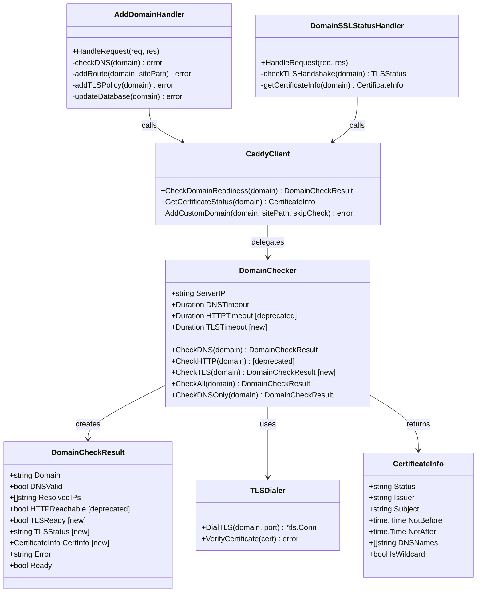

# HTTPS 域名就绪检测方案 - 实现文档

## Implementation Prompt: Domain HTTPS Readiness Verification

### Requirements Anchoring
基于 `.mdfriday/api-domain-management-impl.md` 已实现的域名管理 API，优化域名检测逻辑，移除不可靠的 HTTP 检测，实现基于 TLS 握手的 HTTPS 就绪验证。该方案遵循"用户视角优先"原则，以真实 TLS 连接成功作为 HTTPS 就绪的唯一判断标准。

### Business Model


### Solution

#### 核心设计原则

1. **用户视角优先**
   - 所有"就绪"判断基于真实用户访问行为（HTTPS TLS 握手）
   - 不模拟 ACME 流程，不假设内部状态

2. **主判据与辅判据分离**
   - **主判据（必须）**: TLS 握手成功 + 证书有效
   - **辅判据（可选）**: Caddy Admin API 证书信息（用于展示）

3. **前置检测的定位**
   - DNS 检测：排除明显配置错误（可选）
   - ❌ 不进行 HTTP 检测（不可靠且无意义）
   - TLS 检测：唯一的就绪判断标准

4. **两阶段 API 设计**
   - **Stage 1 (添加域名)**: `/api/license/domain/add` - 仅 DNS 预检（可选）
   - **Stage 2 (查询状态)**: `/api/license/domain/https-status` - TLS 握手检测（主判据）

#### 域名状态定义

| 状态 | 说明 | TLS 握手 | 证书有效 | 用户体验 |
|-----|-----|---------|---------|---------|
| `dns_pending` | DNS 未配置或未生效 | 未尝试 | 未尝试 | 无法访问 |
| `cert_pending` | DNS 就绪，证书申请中 | 失败 | N/A | 无法访问（证书未签发） |
| `cert_error` | 证书签发失败或无效 | 失败/成功 | 无效 | 证书错误提示 |
| `active` | HTTPS 完全就绪 | 成功 | 有效 | ✅ 正常访问 |

#### 实现方案

##### 1. 移除不可靠的 HTTP 检测

**原因**:
- HTTP 可达 ≠ HTTPS 可达
- ACME challenge 路径容易被 CDN/代理/劫持影响
- HTTP-01 的真实行为只能由 Caddy 内部完成

**操作**:
- ❌ 移除 `DomainChecker.CheckHTTP()` 方法
- ❌ 移除 `DomainCheckResult.HTTPReachable` 字段
- ❌ 从 `CheckAll()` 中移除 HTTP 检测逻辑

##### 2. 新增 TLS 握手检测

**核心方法**: `DomainChecker.CheckTLS(domain string)`

**检测逻辑**:
```go
func (c *DomainChecker) CheckTLS(domain string) *DomainCheckResult {
    result := &DomainCheckResult{Domain: domain}
    
    // 1. 尝试 TLS 连接（domain:443）
    dialer := &net.Dialer{Timeout: c.TLSTimeout}
    conn, err := tls.DialWithDialer(dialer, "tcp", domain+":443", &tls.Config{
        ServerName: domain,  // SNI
        MinVersion: tls.VersionTLS12,
    })
    
    if err != nil {
        result.TLSStatus = "cert_pending"
        result.Error = fmt.Sprintf("TLS handshake failed: %v", err)
        return result
    }
    defer conn.Close()
    
    // 2. 验证证书
    certs := conn.ConnectionState().PeerCertificates
    if len(certs) == 0 {
        result.TLSStatus = "cert_error"
        result.Error = "No certificate presented"
        return result
    }
    
    cert := certs[0]
    
    // 3. 验证证书有效期
    now := time.Now()
    if now.Before(cert.NotBefore) || now.After(cert.NotAfter) {
        result.TLSStatus = "cert_error"
        result.Error = "Certificate expired or not yet valid"
        return result
    }
    
    // 4. 验证主机名匹配
    if err := cert.VerifyHostname(domain); err != nil {
        result.TLSStatus = "cert_error"
        result.Error = fmt.Sprintf("Certificate hostname mismatch: %v", err)
        return result
    }
    
    // 5. 提取证书信息
    result.TLSReady = true
    result.TLSStatus = "active"
    result.CertInfo = &CertificateInfo{
        Status:    "issued",
        Issuer:    cert.Issuer.CommonName,
        Subject:   cert.Subject.CommonName,
        NotBefore: cert.NotBefore,
        NotAfter:  cert.NotAfter,
        DNSNames:  cert.DNSNames,
        IsWildcard: strings.HasPrefix(cert.Subject.CommonName, "*."),
    }
    
    return result
}
```

##### 3. 更新 CheckAll 逻辑

**新流程**:
```
CheckAll(domain)
    ↓
CheckDNS(domain)
    ↓ (DNSValid = false)
    ↓ → return {Ready: false, Error: "DNS not configured"}
    ↓ (DNSValid = true)
    ↓
Return {Ready: true, TLSStatus: "dns_ready", Message: "Domain can be added"}

注意：CheckAll 不调用 CheckTLS（TLS 检测在第二阶段进行）
```

##### 4. 新增 HTTPS 状态查询 API

**端点**: `POST /api/license/domain/https-status`

**请求**:
```http
POST /api/license/domain/https-status
Content-Type: multipart/form-data

license_key=MDF-XXXX-XXXX-XXXX
domain=hello.com
```

**响应 - 证书申请中**:
```json
{
  "domain": "hello.com",
  "status": "cert_pending",
  "tls_ready": false,
  "message": "HTTPS certificate is being issued by Let's Encrypt. This usually takes 1-2 minutes.",
  "estimated_time": "1-2 minutes",
  "dns_valid": true,
  "resolved_ips": ["1.2.3.4"]
}
```

**响应 - 证书就绪**:
```json
{
  "domain": "hello.com",
  "status": "active",
  "tls_ready": true,
  "message": "HTTPS is fully operational",
  "certificate": {
    "status": "issued",
    "issuer": "Let's Encrypt",
    "subject": "hello.com",
    "not_before": "2024-01-01T00:00:00Z",
    "not_after": "2024-04-01T00:00:00Z",
    "dns_names": ["hello.com"],
    "is_wildcard": false
  }
}
```

**响应 - 证书错误**:
```json
{
  "domain": "hello.com",
  "status": "cert_error",
  "tls_ready": false,
  "error": "Certificate hostname mismatch: certificate is valid for example.com, not hello.com",
  "troubleshooting": "Please check DNS configuration and wait a few minutes"
}
```

##### 5. 优化 AddDomainHandler 逻辑

**新流程**:
```
POST /api/license/domain/add
    ↓
验证 License 权限
    ↓
检查域名是否已被使用
    ↓
CheckDNS(domain)  ← 只进行 DNS 检测
    ↓ (DNSValid = false)
    ↓ → 返回错误提示配置 DNS
    ↓ (DNSValid = true)
    ↓
AddCustomDomain(domain, sitePath, skipCheck=true)  ← 跳过重复检测
    ↓
更新数据库 (CusDomain = domain)
    ↓
返回: {status: "pending_certificate", message: "Domain added. Use /https-status to check certificate status"}
```

**关键变更**:
- 不在添加时等待证书就绪
- 返回 `pending_certificate` 状态
- 引导用户使用 `/https-status` API 查询

### Structure

#### 数据流向

```
用户添加域名
    ↓
┌─────────────────────────────────┐
│ POST /api/license/domain/add    │
│ - 验证权限                        │
│ - CheckDNS (可选)                │
│ - AddCustomDomain (skipCheck)   │
│ - 数据库更新                      │
│ - 返回: status = "cert_pending"  │
└─────────────────────────────────┘
    ↓
    ↓ (等待 1-2 分钟)
    ↓
用户查询状态 (轮询或手动)
    ↓
┌─────────────────────────────────┐
│ POST /api/license/domain/       │
│      https-status                │
│ - CheckTLS (主判据)              │
│ - 验证证书有效性                   │
│ - 返回: TLS 状态 + 证书信息        │
└─────────────────────────────────┘
    ↓
    ↓ (status = "active")
    ↓
✅ HTTPS 就绪
```

#### 核心方法职责

| 方法 | 职责 | 调用时机 |
|-----|-----|---------|
| `CheckDNS()` | DNS 解析验证 | 添加域名前（可选） |
| ~~`CheckHTTP()`~~ | ~~HTTP 可达性~~ | ❌ 移除 |
| `CheckTLS()` | TLS 握手 + 证书验证（主判据） | 用户查询状态时 |
| `GetCertificateStatus()` | Caddy API 证书信息（辅判据） | 管理后台展示 |

### Tasks

#### Task 1: 更新 DomainCheckResult 结构
1. **Responsibility**: 添加 TLS 相关字段，移除 HTTP 字段
2. **File**: `internal/infrastructure/caddy/domain_checker.go`
3. **Changes**:
   ```go
   type DomainCheckResult struct {
       Domain        string            `json:"domain"`
       DNSValid      bool              `json:"dns_valid"`
       ResolvedIPs   []string          `json:"resolved_ips"`
       // HTTPReachable bool           // ❌ 移除
       TLSReady      bool              `json:"tls_ready"`        // ✅ 新增
       TLSStatus     string            `json:"tls_status"`       // ✅ 新增: dns_pending, cert_pending, cert_error, active
       CertInfo      *CertificateInfo  `json:"certificate,omitempty"` // ✅ 新增
       Error         string            `json:"error,omitempty"`
       Ready         bool              `json:"ready"`
   }
   
   type CertificateInfo struct {
       Status     string      `json:"status"`      // issued, pending, error
       Issuer     string      `json:"issuer"`      // e.g. "Let's Encrypt"
       Subject    string      `json:"subject"`     // e.g. "hello.com"
       NotBefore  time.Time   `json:"not_before"`
       NotAfter   time.Time   `json:"not_after"`
       DNSNames   []string    `json:"dns_names"`
       IsWildcard bool        `json:"is_wildcard"`
   }
   ```

#### Task 2: 移除 CheckHTTP 方法
1. **Responsibility**: 移除不可靠的 HTTP 检测逻辑
2. **File**: `internal/infrastructure/caddy/domain_checker.go`
3. **Changes**:
   - 删除 `CheckHTTP()` 方法（lines 85-116）
   - 从 `DomainChecker` 结构移除 `HTTPTimeout` 字段

#### Task 3: 实现 CheckTLS 方法
1. **Responsibility**: 实现基于 TLS 握手的 HTTPS 就绪检测
2. **File**: `internal/infrastructure/caddy/domain_checker.go`
3. **Method**:
   ```go
   // CheckTLS 检查 HTTPS TLS 握手和证书有效性
   // 这是判断 HTTPS 是否就绪的【主判据】
   func (c *DomainChecker) CheckTLS(domain string) *DomainCheckResult {
       result := &DomainCheckResult{
           Domain:    domain,
           TLSStatus: "cert_pending",
       }
   
       // 创建带超时的 dialer
       dialer := &net.Dialer{
           Timeout: c.TLSTimeout,
       }
   
       // 尝试 TLS 连接
       conn, err := tls.DialWithDialer(dialer, "tcp", domain+":443", &tls.Config{
           ServerName: domain,           // SNI
           MinVersion: tls.VersionTLS12,
       })
   
       if err != nil {
           // TLS 握手失败（证书未签发或网络问题）
           result.Error = fmt.Sprintf("TLS handshake failed: %v", err)
           return result
       }
       defer conn.Close()
   
       // 获取证书
       state := conn.ConnectionState()
       if len(state.PeerCertificates) == 0 {
           result.TLSStatus = "cert_error"
           result.Error = "No certificate presented by server"
           return result
       }
   
       cert := state.PeerCertificates[0]
   
       // 验证证书有效期
       now := time.Now()
       if now.Before(cert.NotBefore) {
           result.TLSStatus = "cert_error"
           result.Error = fmt.Sprintf("Certificate not yet valid (valid from %s)", cert.NotBefore)
           return result
       }
       if now.After(cert.NotAfter) {
           result.TLSStatus = "cert_error"
           result.Error = fmt.Sprintf("Certificate expired (expired on %s)", cert.NotAfter)
           return result
       }
   
       // 验证主机名匹配
       if err := cert.VerifyHostname(domain); err != nil {
           result.TLSStatus = "cert_error"
           result.Error = fmt.Sprintf("Certificate hostname mismatch: %v", err)
           return result
       }
   
       // ✅ TLS 握手成功，证书有效
       result.TLSReady = true
       result.TLSStatus = "active"
       result.Ready = true
       result.CertInfo = &CertificateInfo{
           Status:     "issued",
           Issuer:     cert.Issuer.CommonName,
           Subject:    cert.Subject.CommonName,
           NotBefore:  cert.NotBefore,
           NotAfter:   cert.NotAfter,
           DNSNames:   cert.DNSNames,
           IsWildcard: strings.HasPrefix(cert.Subject.CommonName, "*."),
       }
   
       return result
   }
   ```

#### Task 4: 更新 CheckAll 方法
1. **Responsibility**: 移除 HTTP 检测，保留 DNS 检测
2. **File**: `internal/infrastructure/caddy/domain_checker.go`
3. **Changes**:
   ```go
   // CheckAll 执行域名检查（仅 DNS）
   // 注意：不包含 TLS 检测（TLS 检测在用户查询状态时进行）
   func (c *DomainChecker) CheckAll(domain string) *DomainCheckResult {
       // 检查 DNS
       dnsResult := c.CheckDNS(domain)
       if !dnsResult.DNSValid {
           dnsResult.TLSStatus = "dns_pending"
           return dnsResult
       }
   
       // DNS 就绪
       dnsResult.Ready = true
       dnsResult.TLSStatus = "dns_ready"
       return dnsResult
   }
   ```

#### Task 5: 更新 DomainChecker 结构
1. **Responsibility**: 添加 TLSTimeout 字段，移除 HTTPTimeout
2. **File**: `internal/infrastructure/caddy/domain_checker.go`
3. **Changes**:
   ```go
   type DomainChecker struct {
       ServerIP    string
       DNSTimeout  time.Duration
       // HTTPTimeout time.Duration  // ❌ 移除
       TLSTimeout  time.Duration     // ✅ 新增
   }
   
   func NewDomainChecker(serverIP string) *DomainChecker {
       return &DomainChecker{
           ServerIP:   serverIP,
           DNSTimeout: 10 * time.Second,
           TLSTimeout: 15 * time.Second,  // ✅ 新增
       }
   }
   ```

#### Task 6: 实现 DomainSSLStatusHandler
1. **Responsibility**: 新增 HTTPS 状态查询 API
2. **File**: `internal/interfaces/api/handler/handledomain.go`
3. **Method**:
   ```go
   // DomainSSLStatusHandler 查询自定义域名 HTTPS 状态
   // POST /api/license/domain/https-status
   func (s *Handler) DomainSSLStatusHandler(res http.ResponseWriter, req *http.Request) {
       if req.Method != http.MethodPost {
           res.WriteHeader(http.StatusMethodNotAllowed)
           return
       }
   
       err := req.ParseMultipartForm(apiFrom.MaxMemory)
       if err != nil {
           s.log.Errorf("Error parsing multipart form: %v", err)
           res.WriteHeader(http.StatusInternalServerError)
           return
       }
   
       licenseKey := req.PostForm.Get("license_key")
       domain := req.PostForm.Get("domain")
   
       if licenseKey == "" {
           s.jsonError(res, "License key is required", http.StatusBadRequest)
           return
       }
   
       if domain == "" {
           s.jsonError(res, "Domain is required", http.StatusBadRequest)
           return
       }
   
       // 验证 License 是否存在
       license, err := s.contentApp.GetLicenseByKey(licenseKey)
       if err != nil {
           s.jsonError(res, "License not found", http.StatusNotFound)
           return
       }
   
       // 检查 CustomDomain 权限
       if !license.GetFeatures().CustomDomain {
           s.jsonError(res, "Custom domain feature not enabled", http.StatusForbidden)
           return
       }
   
       // 获取 PublishDomain 记录
       pd, err := s.contentApp.GetPublishDomainByKey(license.LicenseKey)
       if err != nil {
           s.jsonError(res, "Publish domain not found", http.StatusNotFound)
           return
       }
   
       // 验证域名属于该用户
       if pd.CusDomain != domain {
           s.jsonError(res, "Domain does not belong to this license", http.StatusForbidden)
           return
       }
   
       // 1. 先检查 DNS（快速反馈）
       dnsResult, err := s.caddyClient.CheckDomainReadiness(domain)
       if err != nil {
           s.log.Errorf("Failed to check DNS: %v", err)
           s.jsonError(res, "Failed to check domain DNS: "+err.Error(), http.StatusInternalServerError)
           return
       }
   
       // 如果 DNS 未配置，直接返回
       if !dnsResult.DNSValid {
           s.jsonResponse(res, map[string]interface{}{
               "domain":       domain,
               "status":       "dns_pending",
               "tls_ready":    false,
               "dns_valid":    false,
               "resolved_ips": dnsResult.ResolvedIPs,
               "error":        dnsResult.Error,
               "message":      "DNS is not configured correctly. Please point your domain to " + s.adminApp.ServerIP(),
           })
           return
       }
   
       // 2. 执行 TLS 检测（主判据）
       tlsResult := s.caddyClient.GetChecker().CheckTLS(domain)
   
       response := map[string]interface{}{
           "domain":       domain,
           "status":       tlsResult.TLSStatus,
           "tls_ready":    tlsResult.TLSReady,
           "dns_valid":    dnsResult.DNSValid,
           "resolved_ips": dnsResult.ResolvedIPs,
       }
   
       // 根据状态添加消息
       switch tlsResult.TLSStatus {
       case "active":
           response["message"] = "HTTPS is fully operational"
           if tlsResult.CertInfo != nil {
               response["certificate"] = map[string]interface{}{
                   "status":      tlsResult.CertInfo.Status,
                   "issuer":      tlsResult.CertInfo.Issuer,
                   "subject":     tlsResult.CertInfo.Subject,
                   "not_before":  tlsResult.CertInfo.NotBefore,
                   "not_after":   tlsResult.CertInfo.NotAfter,
                   "dns_names":   tlsResult.CertInfo.DNSNames,
                   "is_wildcard": tlsResult.CertInfo.IsWildcard,
               }
           }
   
       case "cert_pending":
           response["message"] = "HTTPS certificate is being issued by Let's Encrypt. This usually takes 1-2 minutes."
           response["estimated_time"] = "1-2 minutes"
           response["troubleshooting"] = "If this persists for more than 5 minutes, please check your DNS configuration."
   
       case "cert_error":
           response["error"] = tlsResult.Error
           response["troubleshooting"] = "Please check DNS configuration and Caddy logs for details."
   
       default:
           response["status"] = "unknown"
           response["error"] = "Unknown TLS status"
       }
   
       s.jsonResponse(res, response)
   }
   ```

#### Task 7: 优化 AddDomainHandler
1. **Responsibility**: 移除 HTTP 检测，优化域名添加流程
2. **File**: `internal/interfaces/api/handler/handledomain.go`
3. **Changes**:
   ```go
   // AddDomainHandler 添加自定义域名
   // POST /api/license/domain/add
   func (s *Handler) AddDomainHandler(res http.ResponseWriter, req *http.Request) {
       // ... 前置验证逻辑保持不变 ...
   
       // 检查域名是否已被其他用户使用
       // TODO: 实现全局域名唯一性检查
   
       // ✅ 只进行 DNS 检测（可选，用于快速反馈）
       dnsResult, err := s.caddyClient.CheckDomainReadiness(domain)
       if err != nil {
           s.log.Errorf("Failed to check domain DNS: %v", err)
           // 不阻塞，继续执行
       } else if !dnsResult.DNSValid {
           // DNS 未配置，返回友好提示
           serverIP := s.adminApp.ServerIP()
           if serverIP == "" {
               serverIP = "your server IP"
           }
           s.jsonError(res, fmt.Sprintf(
               "Domain DNS is not configured correctly. Please point your domain to %s and wait a few minutes for DNS propagation.",
               serverIP,
           ), http.StatusBadRequest)
           return
       }
   
       // sitePath: 自定义域名内容目录
       sitePath := filepath.Join(application.PreviewDir(), s.db.UserDir(), application.CustomDomainFolder())
   
       // ✅ 添加域名（跳过重复检测）
       if err := s.caddyClient.AddCustomDomain(domain, sitePath, true); err != nil {
           s.log.Errorf("Failed to add custom domain to Caddy: %v", err)
           s.jsonError(res, "Failed to add custom domain: "+err.Error(), http.StatusInternalServerError)
           return
       }
   
       // 更新数据库
       now := timestamp.CurrentTimeMillis()
       pd.CusDomain = domain
       pd.Updated = now
       if err := s.contentApp.UpdatePublishDomain(pd); err != nil {
           s.log.Errorf("Failed to update publish domain: %v", err)
           // 回滚：移除 Caddy 配置
           s.caddyClient.RemoveCustomDomain(domain)
           s.jsonError(res, "Failed to update publish domain: "+err.Error(), http.StatusInternalServerError)
           return
       }
   
       // ✅ 返回 pending 状态，引导用户使用 https-status API
       s.jsonResponse(res, map[string]interface{}{
           "domain":  domain,
           "status":  "cert_pending",
           "message": "Custom domain added successfully. HTTPS certificate is being issued by Let's Encrypt (usually 1-2 minutes). Use /api/license/domain/https-status to check certificate status.",
       })
   }
   ```

#### Task 8: 更新 CheckDomainHandler
1. **Responsibility**: 保留用于前置 DNS 检测（可选）
2. **File**: `internal/interfaces/api/handler/handledomain.go`
3. **Changes**:
   ```go
   // CheckDomainHandler 检查域名 DNS 配置（前置检测）
   // POST /api/license/domain/check
   // 注意：此 API 只检查 DNS，不检查 HTTPS 状态
   // HTTPS 状态请使用 /api/license/domain/https-status
   func (s *Handler) CheckDomainHandler(res http.ResponseWriter, req *http.Request) {
       // ... 前置验证逻辑保持不变 ...
   
       // 调用 DNS 检查
       result, err := s.caddyClient.CheckDomainReadiness(domain)
       if err != nil {
           s.log.Errorf("Failed to check domain readiness: %v", err)
           s.jsonError(res, "Failed to check domain: "+err.Error(), http.StatusInternalServerError)
           return
       }
   
       response := map[string]interface{}{
           "domain":       domain,
           "dns_valid":    result.DNSValid,
           "resolved_ips": result.ResolvedIPs,
           "ready":        result.Ready,
       }
   
       if result.Ready {
           response["message"] = "Domain DNS is configured correctly. You can proceed to add this domain."
       } else if result.Error != "" {
           response["error"] = result.Error
       }
   
       s.jsonResponse(res, response)
   }
   ```

#### Task 9: 注册新 API 端点
1. **Responsibility**: 注册 HTTPS 状态查询 API
2. **File**: `internal/interfaces/api/handlers.go`
3. **Changes**:
   ```go
   func (s *Server) registerLicenseHandler() {
       // ... 现有端点 ...
   
       // 自定义域名管理
       s.mux.HandleFunc("/api/license/domain/check", s.wrapContentHandler(s.handler.CheckDomainHandler))
       s.mux.HandleFunc("/api/license/domain/add", s.wrapContentHandler(s.handler.AddDomainHandler))
       s.mux.HandleFunc("/api/license/domain/remove", s.wrapContentHandler(s.handler.RemoveDomainHandler))
       s.mux.HandleFunc("/api/license/domains", s.wrapContentHandler(s.handler.GetDomainsHandler))
       
       // ✅ 新增：HTTPS 状态查询
       s.mux.HandleFunc("/api/license/domain/https-status", s.wrapContentHandler(s.handler.DomainSSLStatusHandler))
   }
   ```

#### Task 10: 添加 GetChecker 方法到 CaddyClient
1. **Responsibility**: 暴露 DomainChecker 供 API 层调用
2. **File**: `internal/infrastructure/caddy/client.go`
3. **Changes**:
   ```go
   // GetChecker 返回域名检查器（供 API 层调用 CheckTLS）
   func (c *Client) GetChecker() *DomainChecker {
       if c.checker == nil {
           c.checker = NewDomainChecker(c.config.ServerIP)
       }
       return c.checker
   }
   ```

#### Task 11: 更新 GetDomainsHandler 展示证书状态
1. **Responsibility**: 在域名列表中展示 TLS 状态
2. **File**: `internal/interfaces/api/handler/handledomain.go`
3. **Changes**:
   ```go
   // GetDomainsHandler 获取用户所有域名配置
   // GET /api/license/domains?key=xxx
   func (s *Handler) GetDomainsHandler(res http.ResponseWriter, req *http.Request) {
       // ... 前置验证逻辑保持不变 ...
   
       // 自定义域名信息
       if pd.CusDomain != "" {
           customDomainInfo := map[string]interface{}{
               "domain": pd.CusDomain,
           }
   
           // ✅ 执行 TLS 检测获取实时状态
           tlsResult := s.caddyClient.GetChecker().CheckTLS(pd.CusDomain)
           
           customDomainInfo["status"] = tlsResult.TLSStatus
           customDomainInfo["tls_ready"] = tlsResult.TLSReady
           
           if tlsResult.TLSReady && tlsResult.CertInfo != nil {
               customDomainInfo["certificate"] = map[string]interface{}{
                   "status":     tlsResult.CertInfo.Status,
                   "issuer":     tlsResult.CertInfo.Issuer,
                   "expires_at": tlsResult.CertInfo.NotAfter,
               }
           }
   
           response["custom_domain"] = customDomainInfo
       }
   
       s.jsonResponse(res, response)
   }
   ```

### Common Tasks

1. **导入声明更新**:
   - 添加 `crypto/tls` 包（用于 TLS 握手）
   - 添加 `time` 包（用于证书有效期验证）
   - 添加 `strings` 包（用于通配符判断）

2. **错误处理规范**:
   - TLS 握手失败 → 返回 `cert_pending`（证书申请中）
   - 证书过期/无效 → 返回 `cert_error`（证书错误）
   - DNS 未配置 → 返回 `dns_pending`（DNS 待配置）

3. **超时配置**:
   - DNS 解析超时: 10 秒
   - TLS 握手超时: 15 秒（需要更长时间）

4. **日志规范**:
   - DNS 检测日志: `[DomainChecker] DNS check for %s: %v`
   - TLS 检测日志: `[DomainChecker] TLS check for %s: %s`
   - 证书信息日志: `[DomainChecker] Certificate for %s: issuer=%s, expires=%s`

### Constraints

#### 功能约束
1. **DNS 检测（可选）**:
   - 用于添加域名前的快速验证
   - 不作为 HTTPS 就绪的判断标准
   - 可以被跳过（开发环境）

2. **TLS 检测（必需）**:
   - 唯一的 HTTPS 就绪判断标准
   - 必须验证证书链完整性
   - 必须验证主机名匹配
   - 必须验证证书有效期

3. **两阶段验证**:
   - Stage 1 (添加域名): 快速返回，DNS 预检（可选）
   - Stage 2 (查询状态): TLS 握手检测（用户主动查询）

#### 性能约束
1. **超时设置**:
   - DNS 解析: 10 秒
   - TLS 握手: 15 秒
   - 避免阻塞用户请求

#### 安全约束
1. **证书验证**:
   - 使用系统证书池验证证书链
   - 验证主机名匹配（防止中间人攻击）
   - 验证证书有效期

2. **权限检查**:
   - 只有域名所有者可以查询状态
   - License 必须有 CustomDomain 权限

### File Structure

```
internal/infrastructure/caddy/
├── domain_checker.go         # 更新: 移除 CheckHTTP, 新增 CheckTLS
│                             # - ❌ 移除 HTTPTimeout, CheckHTTP()
│                             # - ✅ 新增 TLSTimeout, CheckTLS()
│                             # - ✅ 新增 CertificateInfo 结构
│                             # - ✅ 更新 CheckAll() 逻辑
├── client.go                 # 更新: 添加 GetChecker() 方法
│                             # - ✅ 新增 GetChecker() *DomainChecker
└── tls.go                    # 无变更

internal/interfaces/api/
├── handlers.go               # 更新: 注册新端点
│                             # - ✅ 添加 /domain/https-status 路由
└── handler/
    └── handledomain.go       # 更新: 新增 handler + 优化现有 handler
                              # - ✅ 新增 DomainSSLStatusHandler
                              # - ✅ 优化 AddDomainHandler (移除 HTTP 检测)
                              # - ✅ 更新 CheckDomainHandler (明确职责)
                              # - ✅ 更新 GetDomainsHandler (展示 TLS 状态)
```

### Migration Notes

#### API 兼容性
- **保留的 API**:
  - `/api/license/domain/check` - DNS 前置检测（行为不变）
  - `/api/license/domain/add` - 添加域名（返回值变化）
  - `/api/license/domain/remove` - 移除域名（无变化）
  - `/api/license/domains` - 域名列表（增加 TLS 状态）

- **新增的 API**:
  - `/api/license/domain/https-status` - HTTPS 状态查询（新增）

#### 行为变更
1. **添加域名 API**:
   - **之前**: 尝试 HTTP 检测，返回 `ready: true/false`
   - **之后**: 只检测 DNS（可选），返回 `status: "cert_pending"`

2. **域名列表 API**:
   - **之前**: 显示静态证书信息（来自 Caddy Admin API）
   - **之后**: 显示实时 TLS 状态（来自 TLS 握手检测）


### Testing Strategy

#### 单元测试

1. **DNS 检测测试**:
   ```go
   func TestCheckDNS(t *testing.T) {
       checker := NewDomainChecker("1.2.3.4")
       
       // 测试有效 DNS
       result := checker.CheckDNS("example.com")
       assert.True(t, result.DNSValid)
       
       // 测试无效 DNS
       result = checker.CheckDNS("nonexistent.invalid")
       assert.False(t, result.DNSValid)
   }
   ```

2. **TLS 检测测试**:
   ```go
   func TestCheckTLS(t *testing.T) {
       checker := NewDomainChecker("")
       
       // 测试有效 HTTPS（使用公开域名）
       result := checker.CheckTLS("google.com")
       assert.True(t, result.TLSReady)
       assert.Equal(t, "active", result.TLSStatus)
       assert.NotNil(t, result.CertInfo)
       
       // 测试无效证书
       result = checker.CheckTLS("expired.badssl.com")
       assert.False(t, result.TLSReady)
       assert.Equal(t, "cert_error", result.TLSStatus)
   }
   ```

---

## Summary

本实现方案通过以下核心改进，实现了稳定、可解释、与用户真实访问一致的 HTTPS 就绪检测：

### 核心改进

1. **移除不可靠检测**: 删除 HTTP 可达性检测，避免被 CDN/代理误导
2. **基于 TLS 握手的主判据**: 使用真实 TLS 连接验证 HTTPS 就绪状态
3. **两阶段验证流程**: 添加时快速返回，状态查询时进行 TLS 检测
4. **清晰的状态定义**: `dns_pending` / `cert_pending` / `cert_error` / `active`

### 用户体验优化

- 添加域名时立即返回（不等待证书）
- 提供独立的状态查询 API（支持轮询）
- 友好的错误提示和故障排查指南
- 实时的证书状态展示

### 技术优势

- 与用户真实访问行为一致（TLS 握手 + 证书验证）
- 不依赖 ACME 内部状态
- 支持任何 ACME 实现（不限于 Caddy）
- 证书验证逻辑符合 TLS 标准

